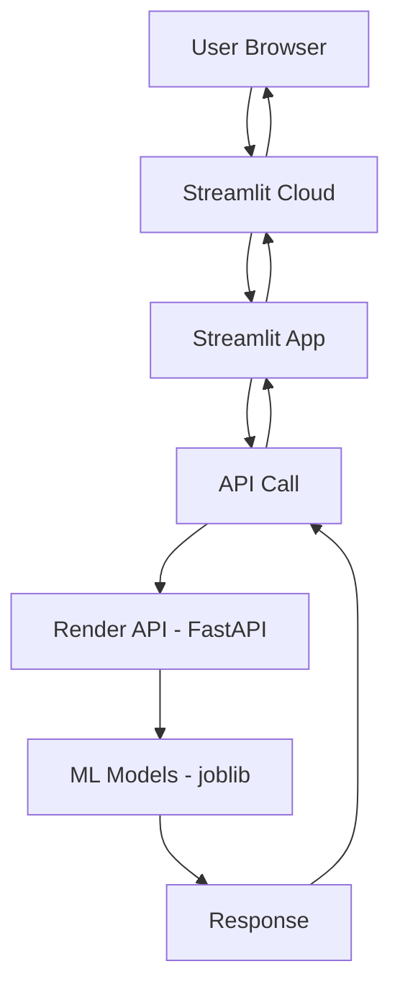

# 💬 Sentiment Analysis — API + Streamlit + CI/CD

[](https://github.com/EdoaUlrich/FeelingsClassificationsOnTwitter/actions/workflows/deploy.yml)
[](https://www.python.org/)
[](https://fastapi.tiangolo.com/)
[](https://streamlit.io/)

Projet complet d'analyse de sentiment (positif / négatif) sur des textes courts
(type tweets/avis) : entraînement du modèle, API **FastAPI**, interface
**Streamlit**, tests automatisés et pipeline **CI/CD** vers **Render** +
**Streamlit Cloud**.

## 🚀 Tester l'outil en ligne

| Service | Lien | Description |
|---|---|---|
| 🖥️ **Interface web** | **[feelingsclassificationsontwitter.streamlit.app](https://feelingsclassificationsontwitter-7jbuu9eyvxevo8a4rdy46u.streamlit.app/)** | Testez l'analyse de sentiment directement dans le navigateur |
| ⚙️ **API** | **[feelingsclassificationsontwitter.onrender.com](https://feelingsclassificationsontwitter.onrender.com)** | API REST — doc interactive sur [`/docs`](https://feelingsclassificationsontwitter.onrender.com/docs) |

> ⏳ L'API est hébergée sur le plan gratuit de Render : après une période
> d'inactivité, le premier appel peut prendre 30 à 60 secondes le temps que
> le service redémarre.

## ✨ Fonctionnalités

- 🔮 Prédiction du sentiment (positif / négatif) d'un texte avec score de confiance
- 🔍 Explication de la prédiction (mots ayant le plus influencé le résultat)
- 🌐 API REST documentée (Swagger / OpenAPI)
- 🎨 Interface utilisateur Streamlit pour tester sans écrire de code
- ✅ Tests automatisés (pytest) + analyse de sécurité (Bandit) + qualité (Flake8)
- 🔄 Déploiement continu automatique sur chaque push vers `main`

## 📁 Structure du projet

```
sentiment-analysis/
├── .github/workflows/deploy.yml   # Pipeline CI/CD (test → build → deploy)
├── .streamlit/
│   ├── config.toml                # Thème Streamlit
│   └── secrets.toml.example       # Modèle pour l'URL de l'API en secret
├── data/reviews.csv               # Jeu de données d'exemple
├── artifacts/
│   ├── sentiment_model.joblib     # Modèle entraîné
│   └── tfidf_vectorizer.joblib    # Vectorizer entraîné
├── train_model.py                 # Script d'entraînement
├── main.py                        # API FastAPI (health, predict, explain)
├── streamlit_app.py                # Interface utilisateur Streamlit
├── test_api.py                     # Tests unitaires (pytest)
├── pytest.ini
├── requirements.txt                # Dépendances de l'API
├── requirements-dev.txt            # + pytest, flake8, bandit (CI)
├── requirements-streamlit.txt       # Dépendances Streamlit
├── render.yaml                     # Config de déploiement Render
└── .gitignore
```

## 🛠️ Installation et utilisation en local

### 1️⃣ Entraîner le modèle

```bash
pip install -r requirements.txt
python train_model.py
```

Cela génère `artifacts/sentiment_model.joblib` et
`artifacts/tfidf_vectorizer.joblib`.

> ⚠️ Le jeu de données `data/reviews.csv` fourni est un petit exemple
> pédagogique (50 phrases). Remplacez-le par vos propres données réelles
> pour obtenir un modèle robuste (idéalement plusieurs milliers d'exemples).

### 2️⃣ Lancer l'API en local

```bash
uvicorn main:app --reload --port 8000
```

Endpoints disponibles sur `http://localhost:8000` :

| Méthode | Endpoint    | Description                                   |
|---------|-------------|------------------------------------------------|
| GET     | `/health`   | Vérifie que l'API et le modèle sont chargés    |
| POST    | `/predict`  | `{"text": "..."}` → sentiment + confiance      |
| POST    | `/explain`  | `{"text": "...", "top_n": 5}` → mots influents |

Documentation interactive auto-générée : `http://localhost:8000/docs`

### 3️⃣ Lancer les tests

```bash
pip install -r requirements-dev.txt
pytest -v
```

### 4️⃣ Lancer l'interface Streamlit en local

```bash
pip install -r requirements-streamlit.txt
streamlit run streamlit_app.py
```

Par défaut elle appelle `http://localhost:8000`. Pour pointer vers l'API de
production, définissez la variable d'environnement `API_URL` ou créez
`.streamlit/secrets.toml` à partir du fichier `.example`.

## ☁️ Déploiement en production

### 🔧 API sur Render

1. Poussez ce repository sur GitHub.
2. Sur [render.com](https://render.com), créez un **Web Service** en connectant
   votre repo (le fichier `render.yaml` est détecté automatiquement).
3. Dans **Settings → Deploy Hook**, copiez l'URL du hook et créez dans GitHub
   (`Settings → Secrets and variables → Actions`) :
   - `RENDER_DEPLOY_HOOK_URL` : l'URL du deploy hook
   - `RENDER_API_URL` : l'URL publique de votre API (ex: `https://feelingsclassificationsontwitter.onrender.com`)

### ✨ Interface sur Streamlit Cloud

1. Sur [share.streamlit.io](https://share.streamlit.io), créez une nouvelle app
   pointant vers `streamlit_app.py` de ce repository.
2. Dans **Settings → Secrets**, ajoutez :
   ```toml
   API_URL = "https://feelingsclassificationsontwitter.onrender.com"
   ```
3. Déployez — l'URL publique est générée automatiquement.

### 🔄 Pipeline CI/CD (`.github/workflows/deploy.yml`)

Chaque push sur `main` déclenche 3 phases obligatoires :

1. **🧪 Test** — pytest (3 endpoints), scan de sécurité Bandit, qualité Flake8
2. **🔧 Build** — validation des artifacts ML, health check local
3. **🚀 Deploy** — déploiement Render + health check production (uniquement si les 2 phases précédentes réussissent)

## 🏗️ Architecture



## 🧰 Stack technique

- **Machine Learning** : scikit-learn, TF-IDF + modèle linéaire, joblib
- **API** : FastAPI, Uvicorn, Pydantic
- **Interface** : Streamlit
- **Tests & qualité** : Pytest, Flake8, Bandit
- **CI/CD** : GitHub Actions
- **Hébergement** : Render (API) + Streamlit Cloud (interface)

